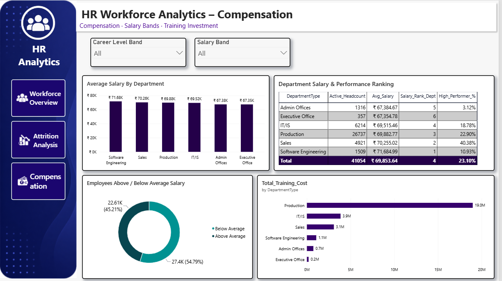

## 📊 HR Workforce Analytics – Power BI Dashboard

An interactive **HR Workforce Analytics dashboard built using Microsoft Power BI** to analyze employee headcount, attrition, compensation, hiring trends, performance, career levels, and training investment.

The project uses **Power Query, DAX, data modeling, and interactive Power BI visualizations** to convert employee data into meaningful HR insights.

---

## 📌 Project Overview

This project presents a comprehensive **HR Workforce Analytics solution** designed to help HR teams and management understand workforce trends and make data-driven decisions.

The dashboard covers three major areas:

* 👥 Workforce Overview
* 📉 Attrition Analysis
* 💰 Compensation Analysis

---

## 🎯 Project Objectives

The main objectives of this project are to:

* Analyze total and active employee headcount
* Monitor employee attrition and termination trends
* Analyze hiring and workforce movement
* Compare salary levels across departments
* Identify high-performing employees
* Analyze employee tenure
* Understand career-level distribution
* Track female workforce representation
* Analyze training investment
* Provide interactive HR insights using Power BI

---

# 🛠️ Tools & Technologies

| Technology             | Purpose                                 |
| ---------------------- | --------------------------------------- |
| **Microsoft Power BI** | Dashboard development and visualization |
| **Power Query**        | Data cleaning and transformation        |
| **DAX**                | Measures, calculated columns and KPIs   |
| **Data Modeling**      | Relationships between tables            |
| **Excel / CSV**        | Data source                             |

---

# 📊 Dashboard Pages

## 1️⃣ Workforce Overview

The Workforce Overview page provides a complete summary of the organization's workforce.

### 🔹 Key KPIs

* **Total Employees:** 50K
* **Active Employees:** 41K
* **Attrition Rate:** 12.72%
* **Average Salary:** ₹69.85K
* **High Performers:** 23.10%
* **Average Tenure:** 4.69 Years
* **Training Investment:** ₹27.93M
* **Female Workforce:** 55.31%

### 🔹 Visualizations

* Headcount by Department
* Career Level Distribution
* Total Employees
* Active Employees
* Attrition Rate
* Average Salary
* High Performers %
* Average Tenure
* Training Investment
* Female Workforce %
* Year filter
* Department filter
* Career Level Band filter

### 📷 Dashboard Preview


---

# 2️⃣ Attrition Analysis

The Attrition Analysis page focuses on employee attrition, hiring trends and workforce movement.

### 🔹 Key KPIs

* **Attrition Rate:** 12.72%
* **Terminated Count:** 6K
* **Attrition Rate YTD:** 5.0%
* **New Hires YoY:** 87.53%

### 🔹 Visualizations

* YoY Hiring (New Hires)
* YTD Hires Trend
* Attrition Rate by Department
* Attrition by Tenure
* Year filter
* Department filter

### 📷 Dashboard Preview


# 3️⃣ Compensation Analysis

The Compensation page provides insights into salary distribution, departmental compensation, employee performance and training investment.

### 🔹 Key Analysis

* Average Salary by Department
* Department Salary & Performance Ranking
* Employees Above / Below Average Salary
* Training Investment by Department
* Active Headcount by Department
* Average Salary by Department
* High Performer %
* Salary Band filter
* Career Level Band filter

### 📷 Dashboard Preview



---

# 🧮 DAX Measures

The dashboard uses DAX measures to calculate important HR KPIs.

## Total Headcount

```DAX
Total_Headcount =
COUNTROWS(EmployeeMaster)
```

## Active Headcount

```DAX
Active_Headcount =
CALCULATE(
    COUNTROWS(EmployeeMaster),
    EmployeeMaster[EmployeeStatus] = "Active"
)
```

## Terminated Count

```DAX
Terminated_Count =
CALCULATE(
    COUNTROWS(EmployeeMaster),
    EmployeeMaster[EmployeeStatus] = "Terminated"
)
```

## Average Salary

```DAX
Avg_Salary =
AVERAGE(EmployeeMaster[Salary])
```

## Attrition Rate

```DAX
Attrition_Rate_% =
DIVIDE(
    [Terminated_Count],
    [Total_Headcount],
    0
)
```

## Gender Diversity Ratio

```DAX
Gender_Diversity_Ratio =
DIVIDE(
    CALCULATE(
        [Active_Headcount],
        EmployeeMaster[GenderCode] = "Female"
    ),
    [Active_Headcount],
    0
)
```

## Bench Utilisation

```DAX
Bench_Utilisation_% =
DIVIDE(
    CALCULATE(
        [Active_Headcount],
        EmployeeMaster[EmployeeStatus] = "Active",
        EmployeeMaster[Performance Score] = "Needs Improvement"
    ),
    [Active_Headcount],
    0
)
```

---

# 📅 Time Intelligence

A dedicated **DimDate** table was created for time-based HR analysis.

### DimDate Columns

* Date
* Year
* Quarter
* Month Number
* Month Name
* Weekday
* Year Quarter

### Active Relationship

```text
DimDate[Date]
       ↓
EmployeeMaster[DateOfJoining]
```

This relationship is used for hiring and new-employee analysis.

### Inactive Relationship

```text
DimDate[Date]
       ↓
EmployeeMaster[DateOfTermination]
```

The inactive relationship can be activated using `USERELATIONSHIP()` for termination and attrition calculations.

Example:

```DAX
Attrition_Rate_YTD =
CALCULATE(
    [Attrition_Rate_%],
    USERELATIONSHIP(
        DimDate[Date],
        EmployeeMaster[DateOfTermination]
    )
)
```

---

# 🔄 Power Query Transformations

Power Query was used for data cleaning and preparation.

### Data Type Transformations

* `DateOfJoining` → Date
* `DateOfTermination` → Date
* `Salary` → Decimal Number
* `Current Employee Rating` → Whole Number

### Data Cleaning

The `DepartmentType` column was trimmed to remove unwanted spaces and maintain consistent department names.

---

# 🧱 Data Model

The project contains the following tables:

* `EmployeeMaster`
* `Training`
* `EngagementSurvey`
* `Performance`
* `Recruitment`
* `DimDate`

### Relationships

```text
                    ┌─────────────────┐
                    │ EmployeeMaster  │
                    └────────┬────────┘
                             │
              ┌──────────────┼──────────────┐
              │              │              │
              ▼              ▼              ▼
          Training    EngagementSurvey   Performance
```

### Date Model

```text
                  ┌───────────┐
                  │  DimDate  │
                  └─────┬─────┘
                        │
                        ▼
               EmployeeMaster
```

The `Recruitment` table is analyzed separately because recruitment applicants do not yet have an Employee ID.

---

# 🧮 Calculated Columns

Several calculated columns were created in the EmployeeMaster table.

### Tenure Years

Employee tenure is calculated based on employee status.

```DAX
Tenure_Years =
VAR EndDate =
    IF(
        EmployeeMaster[EmployeeStatus] = "Active",
        TODAY(),
        EmployeeMaster[DateOfTermination]
    )
RETURN
    DATEDIFF(
        EmployeeMaster[DateOfJoining],
        EndDate,
        YEAR
    )
```

### Other Calculated Columns

* `Career_Level_Band`
* `Full_Name`
* `Days_Since_Hire`
* `Hire_Year_Month`
* `Performance_Label`
* `Salary_Formatted`

---

# 📈 Key Insights

The dashboard provides several important workforce insights:

### 👥 Workforce

* The organization has approximately **50K employees**.
* Around **41K employees are active**.
* Production has the largest employee workforce.

### 📉 Attrition

* Overall selected-period attrition rate is approximately **12.72%**.
* Attrition varies significantly across departments.
* Software Engineering and Production show relatively higher attrition compared with several other departments.
* Tenure-based analysis helps identify employee groups with different attrition patterns.

### 💰 Compensation

* Average employee salary is approximately **₹69.85K**.
* Software Engineering has the highest average salary among the displayed departments.
* Salary levels vary across departments.
* The dashboard compares compensation with high-performer percentages.

### 🎓 Training

* Total training investment is approximately **₹27.93M**.
* Production receives the largest share of training investment.
* Training investment can be compared across departments.

### 👩 Workforce Diversity

* Female employees represent approximately **55.31%** of the workforce.

### 🏆 Performance

* High performers represent approximately **23.10%** of employees.

---

# 💼 Business Value

This dashboard can help HR and management teams to:

* Identify departments with high attrition
* Monitor employee headcount
* Analyze hiring trends
* Compare departmental salary levels
* Monitor high-performing employees
* Understand employee tenure
* Analyze workforce diversity
* Track training investment
* Support compensation decisions
* Make data-driven workforce decisions

---

# 🚀 Skills Demonstrated

This project demonstrates practical knowledge of:

* Microsoft Power BI
* Power Query
* DAX
* Data Modeling
* Time Intelligence
* Calculated Columns
* Measures
* KPI Development
* HR Analytics
* Data Visualization
* Interactive Dashboard Design
* Business Intelligence

---

# 📂 Repository Structure

```text
HR-Workforce-Analytics/
│
├── README.md
│
├── Dashboard/
│   └── HR_Workforce_Analytics.pbix
│
├── Data/
│   └── Employee_Data.xlsx
│
├── Assets/
│   ├── workforce-overview.png
│   ├── attrition-analysis.png
│   └── compensation.png
│
└── Documentation/
    └── Data_Model.png
```

---

# 🎨 Dashboard Design

The dashboard uses a professional HR analytics theme with:

* Interactive slicers
* KPI cards
* Department-level analysis
* Trend charts
* Donut charts
* Bar charts
* Ranking tables
* Consistent navigation
* Interactive filtering

The three dashboard pages provide a complete view of **workforce, attrition and compensation analytics**.

---

# 📌 Project Highlights

### Workforce Overview

**50K Total Employees | 41K Active Employees | ₹69.85K Avg Salary**

### Attrition Analysis

**12.72% Attrition Rate | 6K Terminated | 87.53% New Hires YoY**

### Compensation Analysis

**Department Salary Ranking | High Performer Analysis | ₹27.93M Training Investment**

---

# 👩‍💻 Author

## Sakshi Bagul

**Power BI | Data Analytics | DAX | Power Query | Business Intelligence**

---

## ⭐ If you found this project useful

Feel free to **star ⭐ the repository** and explore the dashboard.

**Thank you for visiting! 🚀**
